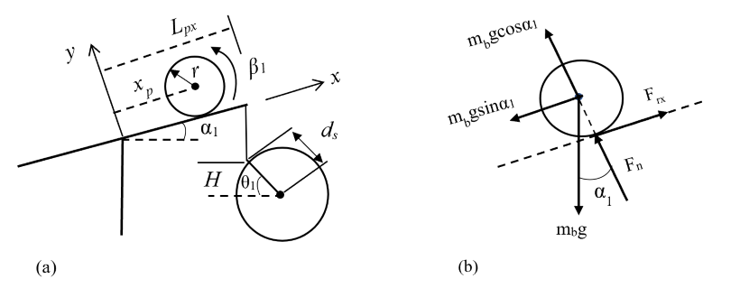
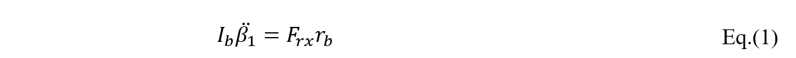
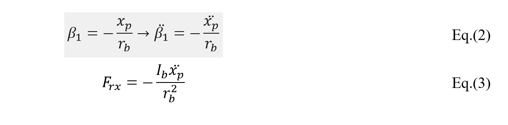
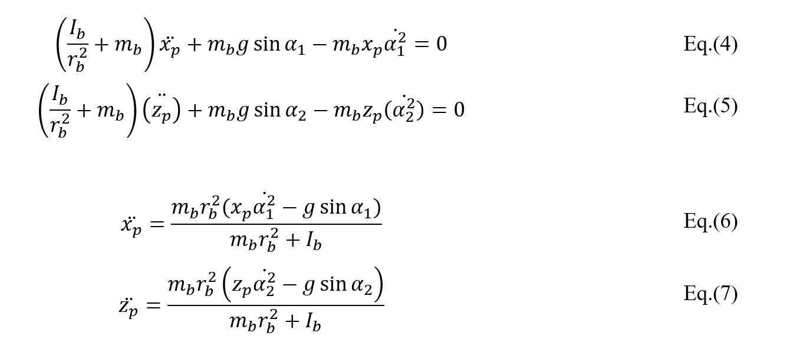
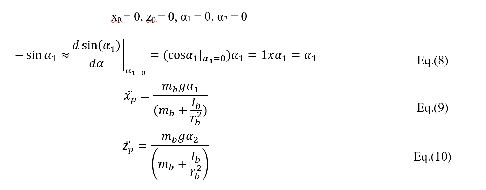
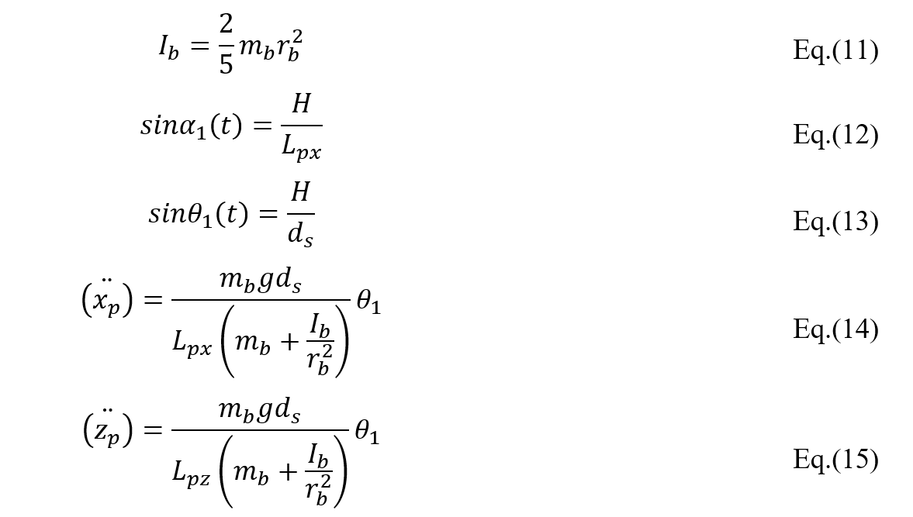

# MECA 482-Fall2021 Ball and Plate System
Group 6: Joseluis Zamora, Jesus Hernandez, Joseph Marlowe, Gerardo Munguia, Jacob Krainock 

## I.Introduction 
The control system design in this report will utilize a ball and plate system. A ball and plate system involves a ball that freely moves about a plate that will tilt due to two servor motors. These servor motors are oriented in two different angular orientations to achieve the desired range or motion. The requirements of the system are listed below:
- [ ] Balance a ball on the center of the plate
- [ ] React to system disburbances

Along with these reqiurements, there are some assumptions used to design the control system.
- [ ] No slipping between the ball and the plate
- [ ] The friction between the plate and the ball is negligible
- [ ] Small angle movements from the servo motors
## II.Mathematical Model
For deriving a mathematical model the system in question must be reduced to a simpler model to find the transfer function. For a ball and plate system it can be reduced to a ball on a beam system. Since the design of the ball and plate system will have identical setups in the *x-y* and *y-z* plane, only the *x-y* plane is modeled below in Figure 1.

  
 **Figure 1**: Ball and Plate system free body diagram of a) the system and b) the ball.  
 
From this simplified model the angular and linear forces can be found and equated. To begin it is known that to balance the ball the forces must be balanced. This is used to find Eq.(1). Then using the assumption that there will be no slipping the angular and linear acceleration of the ball are related, shown in Eq.(2-3). 

  
  

Now the rest of the entire systems force equation can be found, shown in Eq.(4-5). By rearranging the equation to having the input to the system, position, equal to the output, servo angle, the equation can be used to design a control system, this is shown in Eq.(6-7).

  

Next the system will be linearized, this process is shown below resluting in the linearized equation of the system Eq.(9-10).

  

The system will utilize a solid ball and as such will have the moment of inertia shown in Eq.(11). Also, from the system diagram in Figure 1, the angle of the servor motor and the angle of tilt for the plate are represented by Eq.(12-13). Then Eq.(13) is solved for *H* and plugged into Eq.(14) to have an equation that relates the servo gear angle with the position of the ball. Including the linearization, Eq.(14-15) are ready to be solved for the transfer function.

  

## III.Controller Design 
Conventional modern control theory uses the state space representation approach and is useful because criteria desired to a control system can be accomplished. One very important advantage to this theory is the ability to manipulate pole placement while incorporating full state feedback. The beauty of the state space representation is that it allows higher order systems to be modeled as several first order systems. However for this report we are using state space only to check for controllability and observability.  Because humans are spaciall thinkers that are limited, the rest of the control theory is handled by software that makes using state space representations easy. 
## V.Simulink

## VI.Matlab and Coppelia

