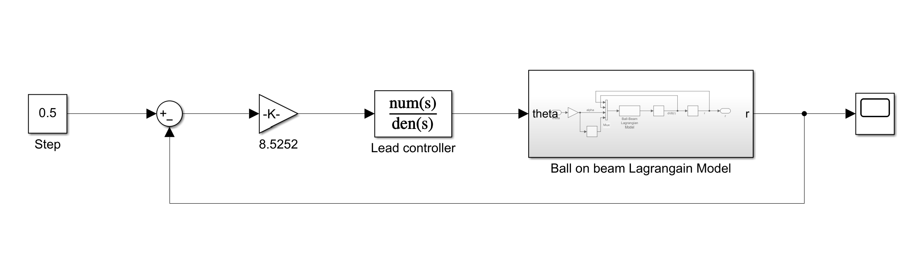
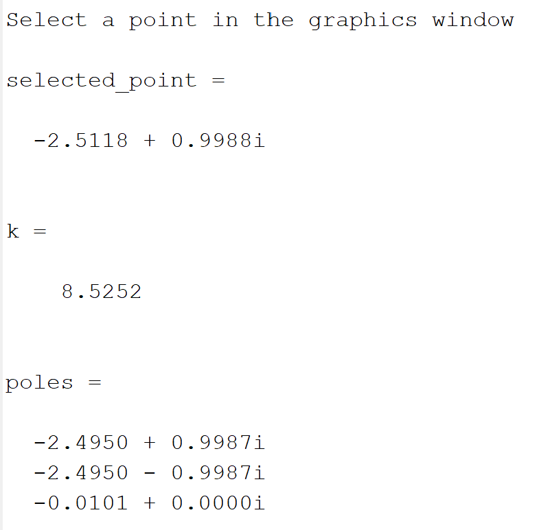

# MECA 482-Fall2021 Ball and Plate System
Group 6: Joseluis Zamora, Jesus Hernandez, Joseph Marlowe, Gerardo Munguia, Jacob Krainock 

## I.Introduction 
The control system design in this report will utilize a ball and plate system. A ball and plate system involves a ball that freely moves about a plate that will tilt due to two servo motors. These servo motors are oriented in two different angular orientations to achieve the desired range or motion. The requirements of the system are listed below:
- [ ] Balance a ball on the center of the plate
- [ ] React to system disturbances

Along with these requirements, there are some assumptions used to design the control system.
- [ ] No slipping between the ball and the plate
- [ ] The friction between the plate and the ball is negligible
- [ ] Small angle movements from the servo motors
## II.Mathematical Model
For deriving a mathematical model the system in question must be reduced to a simpler model to find the transfer function. For a ball and plate system it can be reduced to a ball on a beam system. Since the design of the ball and plate system will have identical setups in the *x-y* and *y-z* plane, only the *x-y* plane is modeled below in Figure 1.

  

 **Figure 1**: Ball and Plate system free body diagram of a) the system and b) the ball.  
 
From this simplified model the angular and linear forces can be found and equated. To begin it is known that to balance the ball the forces must be balanced. This is used to find Eq.(1). Then using the assumption that there will be no slipping the angular and linear acceleration of the ball are related, shown in Eq.(2-3). 

   
   
 

Now the rest of the entire system's force equation can be found, shown in Eq.(4-5). By rearranging the equation to have the input to the system, position, equal to the output, servo angle, the equation can be used to design a control system, this is shown in Eq.(6-7).

  

Next the system will be linearized, this process is shown below resulting in the linearized equation of the system Eq.(9-10).

  

The system will utilize a solid ball and as such will have the moment of inertia shown in Eq.(11). Also, from the system diagram in Figure 1, the angle of the servo motor and the angle of tilt for the plate are represented by Eq.(12-13). Then Eq.(13) is solved for *H* and plugged into Eq.(14) to have an equation that relates the servo gear angle with the position of the ball. Including the linearization, Eq.(14-15) are ready to be solved for the transfer function.

  

By taking the LapLace transform of the Eq.(14-15) the system is represented in the s-domain shown in Eq.(16-17). Then by dividing the input of the system by the output the transfer function of the ball and plate system in two different axis are found, shown in Eq.(18-19)

  

## III.Controller Design 
Conventional modern control theory uses the state space representation approach and is useful because criteria desired to a control system can be accomplished. One very important advantage to this theory is the ability to manipulate pole placement while incorporating full state feedback. The beauty of the state space representation is that it allows higher order systems to be modeled as several first order systems. However for this report we are using state space only to check for controllability and observability.  Due to the complexity of matrix operations, the rest of the control theory is handled by software that makes use of state space representations or the transfer function. 

  
  

With the state space representation the controllability and observability of the ball and plate system can be determined. This done by using:

Qc = [B AB A^2b A^3B]
&  Qo = [C AC A^2C A^3C]

Using these equations the controllability and observability matrices of the system are found to not be equal to zero indicating that the system can be controlled and observed. Next for the control method, the group chose to utilize the root locus method. To accomplish this the system poles and zero must be known. Using matlab this is shown below along with the step response of the system. From the figures, the system has two poles at the origin and the system needs control as with the step response shown the ball will roll off the plate.  

  
  

For the following two design criteria have to be chosen the percent overshoot and the settling time. With values chosen for these two the natural frequency and damping of the system are calculated.

%OS <= 5%

  Ts <= 4s

  Wn = 1.44

  Damping = 0.61

Next the MATLAB is used to locate the roots shown in the figure to the left. From this figure it is noticed that the system has two poles one going to negative and positive infinity. Then to build a lead compensator a pole and zero need to be chosen. For this report, a pole was added at 5 with a zero at 0.01 which is shown in the right figure. Finally using the root locus location finder function in MATLAB the gain for the system is found. The system has a gain (k) of 4.5252, the code and outputs to support this are shown in the Appendix. 

  
  

## V.Simulink
With all this information the simulink model can be built using MATLAB/Simulink. To begin, since the root locus method was chosen a user defined function for the plant of a ball on a beam is used. The model was provided by Prof. Dawn Tilbury at the University of Michigan and Prof. Bill Messner at Carnegie Mellon with funding from NSF. With further support from the MathWorks in 2011 and 2017, Prof. Messner, Prof. Rick Hill (Detroit Mercy), and PhD Student JD Taylor (CMU). 

  

With this model the control system is created using simulink. The control system will multiply the input by the set gain found and then it runs through the lead controller designed. Finally the input is sent into the plant and the output is an angle for the servo motor. The step response of this control system is tested using a constant step response of 0.5 utilizing a closed feedback loop. 

  

For the verification of the system stability the scope tool was added and the generated the following step response. It is noticed that the percent overshoot of the system is under 5% and the settling time of less than 4 seconds. 

  

## VI.Matlab and CoppeliaSim
To connect these two programs an API server is started by CoppeliaSim then MATLAB joins this server. This is easily verified by the command window in MATLAB which indicates if the connection was successful. For this portion the provided ball and plate Coppeliascene was used to test connectivity and create the code needed to ensure proper control of the system. The two programs were able to connect but had errors in trying to send information back and forth. CoppeliaSim was able to start the simulation and wait for MATLAB to connect, which it was able to do. Then MATLAB tries to request childscript to obtain object information but always encounters an indexing error, with CoppeliaSim indicating there was an error in trying to access the mentioned childscript. This problem hindered running the designed Simulink controller on the CoppeliaSim model. 

## VII.References
- [ ] Fabregas, E., Dormido-Canto, S., &amp; Dormido, S. (2017). Virtual and remote laboratory with the ball and Plate System. IFAC-PapersOnLine, 50(1), 9132–9137. https://doi.org/10.1016/j.ifacol.2017.08.1716 
- [ ] Kumar, J. R., Showme, N., Aravind, M., &amp; Akshay, R. (2019, February 7). Design and control of ball on plate system. ResearchGate. Retrieved December 18, 2021, from https://www.researchgate.net/publication/316628039_Design_and_control_of_ball_on_plate_system 
- [ ] Tilbury, D., Messner, B., &amp; Hill, R. (n.d.). Control Tutorials For MATLAB &amp; SIMLINK. Control tutorials for MATLAB and Simulink - Home. Retrieved December 18, 2021, from https://ctms.engin.umich.edu/CTMS/index.php?aux=Home 
- [ ] Zarzycki, K., &amp; Ławryńczuk, M. (2021). Fast real-time model predictive control for a ball-on-plate process. Sensors, 21(12), 3959. https://doi.org/10.3390/s21123959 

## VIII.Appendix

  

  

  

